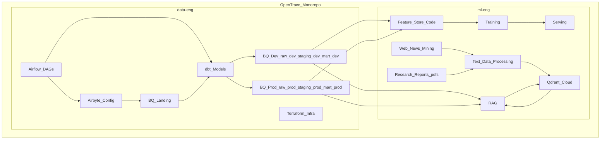

# OpenTrace — Monorepo

This repository is intentionally split into **two sub-repos**:

- **Data Engineering**: [`data-eng/`](data-eng/README.md)
- **ML / AI Engineering**: [`ml-eng/`](ml-eng/README.md)

## Where to start

- For ingestion/orchestration/warehouse: start at **[`data-eng/README.md`](data-eng/README.md)**.
- For feature store/training/RAG/serving: start at **[`ml-eng/README.md`](ml-eng/README.md)**.

## Architecture (monorepo, simplest implementation view)

