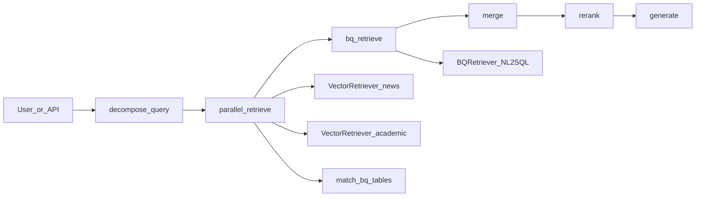

# OpenTrace RAG (`ml/rag`) — architecture

This document describes how the RAG package is structured and how a query flows through it. For setup, commands, and deployment, see [README.md](README.md).

## Purpose

The RAG stack answers natural-language questions by combining:

- **Structured data** from **BigQuery** (bronze-only NL-to-SQL in [`retrievers/bq_retriever.py`](retrievers/bq_retriever.py)).
- **Unstructured / semi-structured text** from **Qdrant Cloud** ([`retrievers/vector_retriever.py`](retrievers/vector_retriever.py)) holding news, academic chunks, and BigQuery table-description chunks.

Orchestration is a **linear LangGraph** in [`chatbot/graph.py`](chatbot/graph.py) (re-exported from root [`graph.py`](graph.py)). Final answers use the **Hugging Face Inference Router** in [`chatbot/generator.py`](chatbot/generator.py), with optional LLM reranking in [`chatbot/reranker.py`](chatbot/reranker.py).

## Directory layout

| Area | Files | Role |
|------|--------|------|
| **Orchestration** | [`chatbot/graph.py`](chatbot/graph.py), [`chatbot/state.py`](chatbot/state.py) | `graph.py`: LangGraph nodes, `run_rag()`, `RAGGraphState`. `state.py`: legacy dataclass-style state (the live graph uses the TypedDict in `graph.py`). |
| **Query understanding** | [`chatbot/query_decomposer.py`](chatbot/query_decomposer.py) | Facets (intent, geography, time window, domains, etc.) via heuristics + optional HF LLM enrichment. Drives **news** vector filters. |
| **BQ table routing** | [`chatbot/bq_table_matcher.py`](chatbot/bq_table_matcher.py), [`chatbot/bronze_dataset_catalog.py`](chatbot/bronze_dataset_catalog.py) | Vector search over `doc_kind=bq_table_description`, grouped by table; each hint fuses **doc snippets** with **column catalog** from [`chatbot/bronze_dataset_model.yml`](chatbot/bronze_dataset_model.yml) or [`dbt/models/sources.yml`](../../dbt/models/sources.yml) (bronze source). |
| **Retrieval** | [`retrievers/base.py`](retrievers/base.py), [`retrievers/vector_retriever.py`](retrievers/vector_retriever.py), [`retrievers/bq_retriever.py`](retrievers/bq_retriever.py) | Retriever base; Qdrant + embeddings (`sentence_transformers` or HF feature API); BQ with validation and bronze-only prompts. |
| **Fusion / ranking** | [`chatbot/reranker.py`](chatbot/reranker.py) | Optional LLM per-chunk scoring via HF; source boosts; trim to `rerank_top_k`. |
| **Generation** | [`chatbot/generator.py`](chatbot/generator.py) | Llama-style prompt with context, decomposition, and **chat memory**; HF router call. |
| **Chat memory** | [`chatbot/chat_memory.py`](chatbot/chat_memory.py), [`chatbot/chat_history.py`](chatbot/chat_history.py), [`chat_history.py`](chat_history.py), [`chat_memory.py`](chat_memory.py) | Summary + last N verbatim turn pairs (env-tunable); legacy truncation for `chat_history`. Root shims re-export for `ml.rag.chat_history` / `ml.rag.chat_memory` imports. |
| **Entry points** | [`run.py`](run.py), [`app/api.py`](app/api.py) (see [`api.py`](api.py) for `uvicorn ml.rag.api:app`), [`chatbot/streamlit_app.py`](chatbot/streamlit_app.py) | CLI, FastAPI (`POST /query`, sessions), Streamlit UI. |
| **Ingestion** | [`ingestion/cli.py`](ingestion/cli.py), [`text_processors/load_pdf_chunks_to_vector_db.py`](text_processors/load_pdf_chunks_to_vector_db.py), preprocessors under [`text_processors/`](text_processors/) | Drive or local files → JSONL → Qdrant; metadata must match `VectorRetriever` filters (`doc_kind`, etc.). |
| **Ops** | [`requirements.txt`](requirements.txt), [`Dockerfile`](Dockerfile), [`README.md`](README.md), [`docs/`](docs/) | Dependencies, image, docs. |
| **Sample assets** | [`Text Documents/`](Text%20Documents/) | Example PDFs for preprocessing (not used at runtime unless indexed). |

## End-to-end pipeline (`run_rag`)

Implemented in [`chatbot/graph.py`](chatbot/graph.py).

1. **decompose** — `decompose_query(query)` → `decomposition` (intent, geo, dates, domains, …).

2. **parallel_retrieve** (three threads):

   - **BQ tables**: `match_bq_tables_from_descriptions` → Qdrant, `doc_kind=bq_table_description`, `top_k=10`; results are **one row per table** with catalog + description text for NL-to-SQL hints.
   - **News**: `VectorRetriever.retrieve` with `doc_kind=news_article`, optional `geo_country`, `published_at_from` / `published_at_to`, `domains_substring` from decomposition or overrides.
   - **Academic**: same retriever, `doc_kind=academic_article`.

   State: `bq_table_candidates`, `vector_news_results`, `vector_academic_results`, `vector_results` (news + academic).

3. **bq_retrieve** — `BQRetriever().retrieve(query, table_hints=…)` using fused hint strings (included in the NL-to-SQL **user** prompt together with the filter guide) plus live BQ schema introspection → `bq_results` (bronze-only SQL path).

4. **merge** — One list: BQ rows with `_context_kind=bigquery`, news prefixed `[News]`, academic `[Academic]`.

5. **rerank** — `rerank(query, merged_context, top_k=rerank_top_k or 8)` (LLM scores or pass-through).

6. **generate** — `generate(query, reranked_context, …)` with `decomposition` and `conversation_summary` / `recent_turns` or legacy `chat_history` → `answer`.

**Optional kwargs** passed into initial graph state: `geo_override`, `time_*_override`, `news_top_k`, `academic_top_k`, `bq_top_k`, `rerank_top_k`, `conversation_summary`, `recent_turns`, `chat_history`.

## BigQuery path (bronze-only)

[`retrievers/bq_retriever.py`](retrievers/bq_retriever.py):

- Env: `BQ_PROJECT`, `BQ_DATASET_BRONZE` (and GCP credentials).
- **NL-to-SQL**: HF router + Llama 3.1 (default `RAG_LLM_MODEL_ID`), with schema filter guide, **prioritized fused table hints** (vector descriptions + YAML/dbt column lists), and live BQ table list in the prompt.
- **Bronze catalog for hints**: [`chatbot/bronze_dataset_catalog.py`](chatbot/bronze_dataset_catalog.py) loads `RAG_BRONZE_MODEL_YAML` (default `ml/rag/chatbot/bronze_dataset_model.yml`), or if that file is empty/unusable, **`dbt/models/sources.yml`** restricted to the **`bronze`** source (`RAG_BRONZE_MODEL_SOURCE` overrides; empty = all sources).
- **Validation**: SELECT-only, forbidden DDL/DML, dataset allowlist, default `LIMIT`.
- **Fallback SQL** when the model fails.

## Vector path (Qdrant)

[`retrievers/vector_retriever.py`](retrievers/vector_retriever.py):

- Env: **`QDRANT_URL`**, **`QDRANT_API_KEY`**, and per-corpus collection names (e.g. `QDRANT_COLLECTION`, `QDRANT_COLLECTION_NEWS`, `QDRANT_COLLECTION_RESEARCH_PAPERS`, `QDRANT_COLLECTION_DATA_DESCRIPTIONS`) as used by the graph and loaders.
- **Embeddings**: `RAG_EMBEDDINGS_MODE` is `local` (default: `sentence_transformers`) or `hf_api` (HF feature-extraction API). **`RAG_EMBEDDING_MODEL_ID`** must match how the collection was populated (dimension and semantics).
- **`vector_search_mode`**: **`legacy`** (news + research; single vector per point), **`sentence_named`** (BQ descriptions), **`ota_triple`**, **`dual`** / **`research_dual`** / **`bq_triple`** for legacy multi-vector collections.
- **Per-corpus embeddings** ([`text_processors/chunking_config.py`](text_processors/chunking_config.py)): news/research use **multilingual-e5** with `query:` / `passage:` prefixes at query/index time; OTA and BQ descriptions use **BGE-small-en**.
- **Filtering**: `doc_kind` and optional news metadata (country, dates, domain), applied server-side when possible and again in the retriever for legacy payloads.

### Chunk JSONL schema (pre-Qdrant)

Preprocessors write one JSON object per line to `data/local/preprocessed_data/*.jsonl` (see `ml.rag.paths`):

| Field | Type | Description |
|-------|------|-------------|
| `id` | string | Stable UUID5 from corpus + `document_id` + `chunk_index` + content hash prefix |
| `text` | string | Chunk body embedded at index time |
| `metadata` | object | Scalar payload fields (see below) |

Required metadata spine (all corpora):

| Key | Description |
|-----|-------------|
| `document_id` | Stable id for the source file or dedupe id |
| `chunk_index` / `total_chunks` | Position within the document |
| `content_hash` | SHA-256 of normalized chunk text (dedup / manifest) |
| `ingest_version` | Pipeline version string (`chunking_config.INGEST_VERSION`) |
| `section_path` | Heading / subsection path when structure-aware chunking applies |
| `doc_kind` | `news_article`, `academic_article`, `bq_table_description`, … |

Corpus-specific keys include `published_at`, `title`, `country` (news), `table_name` (BQ), `strategy` (research). Loaders map `text` → Qdrant payload `content` and filter to per-collection allow-lists in [`text_processors/load_pdf_chunks_to_vector_db.py`](text_processors/load_pdf_chunks_to_vector_db.py).

**Reindex policy:** bump `INGEST_VERSION` or pass `--reset` on loaders when chunking or embedding models change; use [`text_processors/ingest_manifest.py`](text_processors/ingest_manifest.py) during preprocess to skip unchanged `content_hash` values.

## LLM usage

| Step | Module | When |
|------|--------|------|
| Decomposition (optional) | [`chatbot/query_decomposer.py`](chatbot/query_decomposer.py) | If `HF_API_TOKEN` is set; heuristics always run. |
| NL-to-SQL | [`retrievers/bq_retriever.py`](retrievers/bq_retriever.py) | When token set; else fallback / limited behavior. |
| Reranking | [`chatbot/reranker.py`](chatbot/reranker.py) | If `HF_API_TOKEN` and `RAG_LLM_RERANK` is not off. |
| Answer | [`chatbot/generator.py`](chatbot/generator.py) | Primary user-facing generation. |
| Memory compaction | [`chatbot/chat_memory.py`](chatbot/chat_memory.py) | Optional HF when evicting turns past the verbatim window. |

## API and UI

- **[`app/api.py`](app/api.py)** (`ml.rag.app.api`, served as **`ml.rag.api:app`**): `POST /query`, `GET /health`. Server-side **sessions** via `session_id` and in-memory `{conversation_summary, recent_turns}`, or client `conversation_history`. CORS: `RAG_CORS_ORIGINS`.
- **[`chatbot/streamlit_app.py`](chatbot/streamlit_app.py)**: Calls `run_rag` with session state and sidebar sessions.
- **[`run.py`](run.py)**: `python -m ml.rag.run "…"` for CLI smoke tests.

## Configuration and env vars

Full tables and run commands are in [README.md](README.md). Conceptually:

- **BigQuery**: `BQ_PROJECT`, `BQ_DATASET_BRONZE`, `GOOGLE_APPLICATION_CREDENTIALS`
- **Bronze table catalog (hints)**: `RAG_BRONZE_MODEL_YAML` (optional path), `RAG_BRONZE_MODEL_SOURCE` (dbt source name to extract, default `bronze`; set empty to merge every source in that YAML)
- **HF**: `HF_API_TOKEN`, `RAG_LLM_MODEL_ID`, `RAG_LLM_RERANK`, optional `RAG_SUMMARY_MODEL_ID`
- **Qdrant**: `QDRANT_URL`, `QDRANT_API_KEY`, collection env vars as in README
- **Chat memory**: `RAG_CHAT_VERBATIM_TURNS`, `RAG_CHAT_HISTORY_MAX_TURNS`, `RAG_CHAT_HISTORY_MAX_CHARS`, `RAG_SUMMARY_MAX_CHARS` (see README and [`chatbot/chat_memory.py`](chatbot/chat_memory.py))

## Design notes

- **Bronze-only for live SQL** — `BQRetriever` does not target silver/gold; the vector index may still contain text about other layers if ingested that way.
- **Streamlit** runs the app script in a subprocess; rely on env/config for server options, not `sys.argv` inside the app.
- **API session store** is **single-process**; horizontal scaling needs external session storage or sticky sessions.

## Related docs

- [docs/BQ_NL2SQL_PLAN.md](docs/BQ_NL2SQL_PLAN.md) — NL-to-SQL design (bronze scope).
- [docs/EXPECTED_QUESTIONS.md](docs/EXPECTED_QUESTIONS.md) — Example question types.
