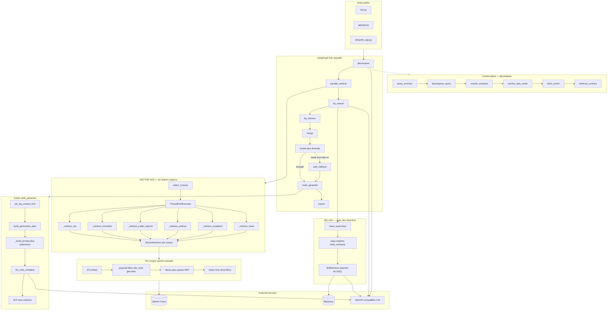
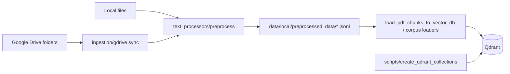
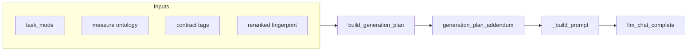

# OpenTrace RAG (`ml/rag`) — architecture

This document explains **how the RAG package is structured**, how data flows at **query time** and **ingest time**, and how components connect. For copy-paste commands and troubleshooting, see [README.md](README.md). For per-script CLI flags and examples, see [docs/SCRIPTS.md](docs/SCRIPTS.md).

---

## 1. Purpose and design principles

The RAG stack answers natural-language questions about African agriculture and food security by combining **two co-equal retrieval legs**:

| Source | Technology | Role |
|--------|------------|------|
| **Unstructured text (VECTOR LEG)** | Qdrant Cloud (six corpora) | News, academic papers, policies, public reports, formation, OTA insights — via corpus router + E5/hybrid cascade |
| **Structured tables (BQ LEG)** | BigQuery (`BQ_DATASET_GOLD` / `mart_dev`) | Class supervisor → class engines → **`bind_contracts`** → planned NL2SQL execute → row-level facts |
| **Orchestration** | LangGraph in [`chatbot/graph.py`](chatbot/graph.py) | Control plane → **vector leg** + **BQ leg** (bind-first planned path) → merge → rerank → **generation strategy** → generate |
| **Generation** | [`llm_chat.py`](llm_chat.py) + [`generation_plan.py`](chatbot/generation_plan.py) | OpenAI-compatible backend; post-retrieval strategy shapes answer/evidence before the LLM call |

**Design choices:**

- **Vector and BQ are peers** — unstructured corpora are not an afterthought. The graph runs `parallel_retrieve` (six Qdrant corpora in a thread pool) then the BQ leg; both outputs fuse at `merge`. Neither leg waits on the other's *results* — only graph node ordering is sequential.
- **Bind-first warehouse path** — class engines emit `TableBindContract` / `bind_contracts` (SQL-less). [`BQRetriever`](retrievers/bq_retriever.py) with `retrieve_mode=planned` runs **NL2SQL only** (no template/pattern fact path). Mart YAML + dim spine pack filter/join context into the NL2SQL prompt.
- **Three-layer reasoner stack** — (1) **pre-retrieval**: enricher → decompose → ontology → `task_mode` → [`retrieval_contract`](chatbot/retrieval_contract.py); (2) **retrieval**: [`select_corpora`](chatbot/corpus_catalog.py) + class engines / plan builder + rerank; (3) **post-retrieval**: [`build_generation_plan`](chatbot/generation_plan.py) decides answer shape and evidence priority before `generate`.
- **Ontology aids table/measure scope** (not a substitute for bind + NL2SQL); fallback only after retries.
- **Staging-only SQL** — live queries never target silver/gold; vector chunks may still *describe* other layers.
- **Three query views** — vector always embeds the full `user_query`; optional `context_rewrite` (related history + profile) and `detail_rewrite` (deterministic twin) are companions. Soft-fail `user_query_dropped` if retrieve omits the full user question. See §5.0.
- **Session KV reuse** — prior-turn vector hits and BQ fact rows may be reused when fingerprints still match; never cache final report/compare/outlook answers.
- **Fail-soft LLM** — empty LLM responses trigger ontology/heuristic fallbacks or “context only” answers.
- **Legacy stubs** — [`sql_compiler.py`](chatbot/sql_compiler.py) / [`SqlRequest`](chatbot/sql_request.py) are **not** owners of fact-path SQL; they remain only as refuse/legacy flags. Do not revive compiler-assembled SELECTs on the default class path.

---

## 2. High-level system diagram

### 2.1 Query-time (runtime)


```mermaid
flowchart TB
  subgraph entry [Entry points]
    CLI[run.py]
    API[app/api.py]
    ST[streamlit_app.py]
  end

  subgraph control [Control plane — decompose]
    EN[query_enricher]
    DEC[decompose_query]
    FE[facet_enrich]
    RC[retrieval_contract]
    ONT[resolve_measure]
    TM[resolve_task_mode]
    EN --> DEC --> ONT --> TM --> FE --> RC
  end

  subgraph graph [LangGraph full_rag path]
    D[decompose]
    PR[parallel_retrieve]
    BQR[bq_reason]
    BQ[bq_retrieve]
    M[merge]
    R[rerank plus diversify]
    WF[web_fallback]
    NG[node_generate]
    X[export]
    D --> PR --> BQR --> BQ --> M --> R
    R -->|weak and web on| WF --> NG
    R -->|enough| NG --> X
  end

  entry --> D
  D -.-> control

  subgraph vectorLeg [VECTOR LEG — six Qdrant corpora]
    SC[select_corpora]
    TP[ThreadPoolExecutor]
    RN[_retrieve_news]
    RA[_retrieve_academic]
    RP[_retrieve_policies]
    RPR[_retrieve_public_reports]
    RF[_retrieve_formation]
    RO[_retrieve_ota]
    VR[VectorRetriever per corpus]
    SC --> TP
    TP --> RN & RA & RP & RPR & RF & RO
    RN & RA & RP & RPR & RF & RO --> VR
  end

  PR --> vectorLeg

  subgraph bqLeg [BQ LEG — mart_dev bind-first]
    SUP[class_supervisor]
    ENG[class engines bind_contracts]
    BR[BQRetriever planned NL2SQL]
    BQR --> SUP --> ENG --> BR
  end

  subgraph perCorpus [Per-corpus search cascade]
    EMB[E5 embed]
    FIL[payload filters doc_kind geo time]
    HYB[dense plus sparse RRF]
    CAS[widen time drop filters]
    EMB --> FIL --> HYB --> CAS
  end

  VR --> perCorpus

  subgraph generateInternals [Inside node_generate]
    PIN[pin_bq_context_first]
    GP[build_generation_plan]
    PROMPT[_build_prompt plus addendum]
    LLM[llm_chat_complete]
    ACF[ACF plus citations]
    PIN --> GP --> PROMPT --> LLM --> ACF
  end

  NG --> generateInternals

  subgraph external [External services]
    QD[(Qdrant Cloud)]
    BQDB[(BigQuery)]
    LLMsvc[OpenAI-compatible LLM]
  end

  perCorpus --> QD
  BR --> BQDB
  D --> LLMsvc
  BQR --> LLMsvc
  BR --> LLMsvc
  LLM --> LLMsvc
```

**Dual-leg model:** Vector hits land in `vector_*_results` state fields; BQ rows land in `bq_results`. **`merge`** is the first node that combines both legs into `merged_context`. **`rerank`** scores the fused pool (default pool 24, output ~18) and **`diversify_context_pack`** prevents a news-only flood. **`build_generation_plan`** (inside `node_generate`, after rerank) reads the reranked fingerprint plus `task_mode`/ontology — it shapes the prompt but does **not** filter chunks in v1.

`select_corpora` (heuristic gate, max soft-skip 3) chooses which of the six collections to query in a thread pool. Each selected corpus runs the shared `VectorRetriever` path: E5 embed → payload filters → optional hybrid dense+sparse RRF → filter cascade (widen time ±1y, drop time, drop geo). Soft-fail empty corpora continue the graph.

| Key | Env | Default collection | `doc_kind` | State field |
|-----|-----|--------------------|------------|-------------|
| news | `QDRANT_COLLECTION_NEWS` | `news_data` | `news_article` | `vector_news_results` |
| academic_papers | `QDRANT_COLLECTION_ACADEMIC_PAPERS` | `academic_papers` | `academic_article` | `vector_academic_papers_results` |
| policies | `QDRANT_COLLECTION_POLICIES` | `policies` | `policy_document` | `vector_policies_results` |
| public_reports | `QDRANT_COLLECTION_PUBLIC_REPORTS` | `public_reports` | `public_report` | `vector_public_reports_results` |
| formation | `QDRANT_COLLECTION_FORMATION` | `formation` | `agricultural_practise` | `vector_formation_results` |
| ota | `QDRANT_COLLECTION_OTA_INSIGHTS` | `OTA_insights` | `ota_insight` | `vector_ota_results` |

Optional legacy mixed research collection (`QDRANT_COLLECTION_RESEARCH_PAPERS` / `research_other_papers`) runs only when `RAG_USE_LEGACY_RESEARCH_COLLECTION=on`.

**Task modes** (`chatbot/task_mode.py`): after enricher/decompose/ontology, `full_rag` sets `task_mode` with precedence **clarify → analytical → data_export_only → fact_lookup → research → briefing → chat**. Clarify is terminal `generate_clarify` (measure-aware slots). Other modes share vector → BQ → generate → export with mode-specific BQ plans and generation prompts.

Regenerate visual PDF/DOCX: `python scripts/generate_rag_architecture_pdf.py` and `python scripts/generate_rag_architecture_docx.py` from `ml-eng/` (diagrams under `docs/diagrams/`).

### 2.2 Ingest-time (offline)


```mermaid
flowchart LR
  GD[Google Drive folders] --> SYNC[ingestion/gdrive sync]
  LOCAL[Local files] --> PRE[text_processors/preprocess]
  SYNC --> PRE
  PRE --> JSONL[data/local/preprocessed_data/*.jsonl]
  JSONL --> LOAD[load_pdf_chunks_to_vector_db / corpus loaders]
  LOAD --> QD[(Qdrant)]
  SPEC[scripts/create_qdrant_collections] --> QD
```

---

## 3. Repository layout (`ml/rag/`)

Annotated tree (libraries and tests omitted). Paths are relative to `ml-eng/ml/rag/`.

```
ml/rag/
├── ARCHITECTURE.md          ← this file
├── README.md                ← setup, env tables, run commands
├── docs/
│   ├── SCRIPTS.md           ← script reference
│   ├── BQ_NL2SQL_PLAN.md
│   └── EXPECTED_QUESTIONS.md
├── chatbot/                 ← runtime orchestration + UI
├── retrievers/              ← BQ + Qdrant retrieval
├── text_processors/         ← chunk, preprocess, load to Qdrant
├── ingestion/               ← Drive → preprocess → upsert (rebuild CLI)
├── scripts/                 ← Qdrant collection create / indexes
├── eval/                    ← retrieval@k smoke tests
├── bq_tables_yaml_files/    ← per-table semantic schemas for NL-to-SQL hints
├── helpers/                 ← offline utilities (e.g. YAML generation)
├── app/                     ← FastAPI (`ml.rag.app.api`)
├── graph.py                 ← re-export `run_rag` from chatbot/graph.py
├── run.py                   ← CLI entry
├── api.py                   ← uvicorn target for API
├── paths.py                 ← canonical JSONL paths under ml-eng/data/local
├── local_env.py             ← load ml-eng/config/.env + data/local/.env
├── llm_chat.py              ← unified OpenAI-compatible LLM client
├── sparse_embeddings.py     ← BM25 sparse vectors (hybrid search)
├── chunking_config.py       ← per-corpus profiles (single source of truth)
└── inspect_vector_db.py     ← Qdrant payload inspection
```

---

## 4. Runtime pipeline (`run_rag`)

Implemented in [`chatbot/graph.py`](chatbot/graph.py). Entry: `run_rag(query, **kwargs)` → final `RAGGraphState`.

### 4.1 Graph nodes (in order)

| Node | Function | Reads state | Writes state |
|------|----------|-------------|--------------|
| **decompose** | enricher + `decompose_query` + ontology + contract | `query`, memory | `decomposition`, `task_mode`, `measure_id`, route flags |
| **parallel_retrieve** | `select_corpora` + thread pool + six `_retrieve_*` | `query`, `decomposition`, `task_mode`, overrides | `vector_news_results`, `vector_academic_papers_results`, `vector_policies_results`, `vector_public_reports_results`, `vector_formation_results`, `vector_ota_results`, `corpus_selection` |
| **bq_reason** | mart YAML SQL reasoner | `query`, `decomposition`, `task_mode` | `bq_sql_plan`, `bq_table_candidates` |
| **bq_retrieve** | `BQRetriever.retrieve` | `query`, `decomposition`, hints | `bq_results`, (SQL in row metadata) |
| **merge** | concat + corpus labels + OFIA tier | all `vector_*_results` + `bq_results` | `merged_context` |
| **rerank** | `rerank` + `diversify_context_pack` | `query`, `merged_context`, `task_mode` | `reranked_context` |
| **web_fallback** | Wikipedia / Tavily (optional) | `reranked_context` | `web_results`, may append to `reranked_context` |
| **generate** | `build_generation_plan` → `generate` | `query`, `reranked_context`, memory, `task_mode` | `answer`, `citations`, `generation_plan`, ACF fields |
| **export** | artifact builder | `answer`, `export_intent` | `artifacts` |

After `bq_retrieve`, the graph aggregates distinct executed SQL strings into **`bq_sql_queries`** (for Streamlit/debug).

Short-circuit nodes (`generate_meta`, `generate_product`, `generate_social`, `generate_clarify`, `insufficient_context`) skip retrieval and generation strategy.

### 4.2 `RAGGraphState` fields

| Field | Description |
|-------|-------------|
| `query` | Latest user question |
| `decomposition` | `intent`, `entities`, `geography`, `domains`, `time_start`, `time_end`, `primary_measures`, `corpus_domain_tags` |
| `task_mode` | `clarify`, `analytical`, `fact_lookup`, `briefing`, `data_export_only`, `research`, `chat` |
| `measure_id`, `recency_tier` | From [`agri_measure_ontology`](chatbot/agri_measure_ontology.py) |
| `bq_table_candidates` | One hint dict per mart table selected by the YAML reasoner (`source: mart_yaml`) |
| `vector_news_results` | News chunks from Qdrant |
| `vector_academic_papers_results` | Academic paper chunks |
| `vector_policies_results` | Policy document chunks |
| `vector_public_reports_results` | Public report chunks |
| `vector_formation_results` | Formation / extension chunks |
| `vector_ota_results` | OTA insight chunks |
| `vector_academic_results` | Deprecated alias; prefer per-corpus keys above |
| `bq_results` | BigQuery rows as context dicts (`metadata.sql`, row fields) |
| `bq_sql_queries` | Unique SQL strings executed |
| `merged_context` | BQ + all vector corpora before rerank |
| `reranked_context` | Diversity-packed subset passed to generator |
| `generation_plan` | Post-retrieval strategy dict (`answer_shape`, `evidence_priority`, `must_ground_in`, `rationale`) — debug/inspector |
| `answer` | Final text |
| `citations` | Structured source refs resolved from packed context |
| `geo_override`, `time_*_override` | UI/API overrides for vector + BQ |
| `news_top_k`, `academic_top_k`, `ota_top_k`, `bq_top_k`, `rerank_top_k` | Retrieval limits (code defaults in `graph.py`; optional env override for rerank pool only) |
| `conversation_summary`, `recent_turns` | Multi-turn generator memory |
| `chat_history` | Legacy verbatim-only history |

### 4.3 Optional `run_rag` kwargs

Passed from Streamlit, API, or CLI wrappers: `geo_override`, `time_start_override`, `time_end_override`, `news_top_k`, `academic_top_k`, `bq_top_k`, `rerank_top_k`, `conversation_summary`, `recent_turns`, `chat_history`.

---

## 5. Query understanding

### 5.0 Query views + session KV ([`chatbot/query_views.py`](chatbot/query_views.py))

Ask ADZA never replaces the user question as the sole embed string.

| View | Content | Vector | BQ / decompose |
|------|---------|--------|----------------|
| `user_query` | `normalize_query_text(raw)` — never replaced | Always | Always |
| `context_rewrite` | Chat history + profile prefs **only when related** to this turn | Yes if non-empty and ≠ user | Yes if `context_applied` |
| `detail_rewrite` | Deterministic twin (geos, products, years, crop\|livestock, measures) | Yes if non-empty and ≠ others | **Never** (avoids SQL drift) |

**Relatedness gate** (context rewrite): elliptical/anaphoric follow-ups, topic overlap with prior user turns, or explicit “same / that / what about”. Unrelated prior turns must not be glued on. Profile country / category / `plan_type` are **scope hints only** — they do not invent measures.

**Vector retrieve:** run up to three Qdrant passes (one per distinct text), merge with `_merge_scored_hits`. Hybrid sparse uses the **same text** as that pass.

**Session KV** (via [`session_store.py`](session_store.py); never cache final analytical answers):

| Kind | Key shape | Value |
|------|-----------|--------|
| Vector | `adza:ret:v1:{session}:{text_hash}:{corpora}:{geo}:{year}` | Compact hits (id, score, corpus) |
| BQ facts | `adza:bq:v1:{session}:{bind_fingerprint}` | Compact rows + job metadata |

Reuse BQ only when context applied **or** current facets are a subset/refinement of the cached fingerprint; hard miss on new country/measure.

**Soft-fail:** `user_query_dropped=true` if any vector path omits the full `user_query`.

### 5.1 [`chatbot/query_decomposer.py`](chatbot/query_decomposer.py)

**Always runs heuristics** (country aliases, relative dates like “past decade”, domain keywords).

**Optional LLM enrichment** when `HF_API_TOKEN` or `RAG_LLM_BASE_URL` is set — merges JSON fields into the heuristic result.

**Output shape:**

```json
{
  "intent": "descriptive|predictive|diagnostic|...",
  "entities": ["..."],
  "geography": ["Nigeria"],
  "domains": ["agribusiness", "economy"],
  "time_start": "2013-01-01",
  "time_end": "2022-12-31"
}
```

**Used by:**

- **News / research** — `resolve_retrieval_geographies()` (one or many countries); multi-country uses `geo_countries` in Qdrant `Filter(should=...)`. Research years use `MatchAny` on KEYWORD `publication_year` (not numeric `Range`).
- **BQ** — passed into `BQRetriever` as `geo_country`, `time_start`, `time_end`, `entities`, `domains` (structured “REQUIRED filters” in NL-to-SQL prompt).

**Not used for:** academic vector filters today (academic also gets geo/time in `graph._retrieve_academic`).

### 5.2 BQ plan builder + mart YAML context

`node_bq_reason` builds `bq_sql_plan` via [`_build_bq_sql_plan`](chatbot/graph.py) (see priority below). On the default class path, engines write **`bind_contracts`** + `query_intents` (`sql=None`); they do not emit SELECT strings. Mart YAML under [`bq_mart_tables_yaml_files/`](bq_mart_tables_yaml_files/) (via [`bq_table_schema_yaml.py`](chatbot/bq_table_schema_yaml.py)) packs column allowlists, filter samples, and dim spine into NL2SQL hints.

**Plan metadata** ([`bq_plan.py`](chatbot/bq_plan.py)):

| Field | Meaning |
|-------|---------|
| `plan_source` | Who built the plan: `class_engine`, `slot_reasoner`, `analytical`, `compile_error`, `retrieval_contract`, … |
| `retrieve_mode` | `planned` (NL2SQL-only) vs `legacy` (template/pattern allowed) |
| `bind_contracts` | Per-table bind map for planned NL2SQL (`inject_bind` into prompts) |
| `nl2sql_fallback` | Allow NL2SQL when bind/compile_error path needs it |

**Planner priority** (do not reorder without tests):

1. Slot reasoner (when active + `bq_subquestions`)
2. Class engines → `bind_contracts` (planned)
3. Analytical / export → `reason_bq_sql_plan` escape
4. `compile_error` block when classes empty and compiler preference on
5. Legacy `reason_bq_sql_plan` only when compiler preference off

**Mart column YAML catalog:** Generated by `data-eng/data/local/scripts/regenerate_mart_table_yamls.py`. Curated semantics via [`helpers/patch_mart_yaml_semantics.py`](helpers/patch_mart_yaml_semantics.py). Indicator classes in [`helpers/mart_indicator_classes.yaml`](helpers/mart_indicator_classes.yaml).

**BQ enrich + ACF stamping:** After execute, [`bq_context_enrich.py`](chatbot/bq_context_enrich.py) stamps warehouse contract fields via [`acf_metadata.project_bq_row_acf`](chatbot/acf_metadata.py). Path B ACF ([`acf_scoring.py`](chatbot/acf_scoring.py)) scores **cited** evidence only at generation time.

### 5.3 Bind ownership vs legacy stubs (SQL ownership)

**Fact-path SQL is produced by planned NL2SQL in the retriever**, constrained by bind contracts. Class engines never write SELECTs on the default path.

| Layer | Owns | Must not |
|-------|------|----------|
| [`query_decomposer`](chatbot/query_decomposer.py) + [`facet_compiler`](chatbot/facet_compiler.py) | job, geos, time, entities, shape, `entity_roles` | SQL |
| [`class_supervisor`](chatbot/class_supervisor.py) | 1–2 classes + secondary, out_of_scope, must_search_qdrant | SQL, skip_bq |
| Class engines + [`compile_table_bind_contract`](chatbot/bq_table_schema_yaml.py) | `bind_contracts`, intents, mart/dim hints | SELECT strings |
| [`bq_retriever`](retrievers/bq_retriever.py) | Planned NL2SQL + execute; honors `retrieve_mode` | Invent filters outside bind/YAML |
| [`generator`](chatbot/generator.py) | prose from evidence; typed BQ gaps | Invent warehouse numbers |
| [`sql_compiler`](chatbot/sql_compiler.py) / [`SqlRequest`](chatbot/sql_request.py) | Legacy / refuse stubs only | Fact-path assembly |

[`global_reasoner`](chatbot/global_reasoner.py) and [`intent_bundles.yaml`](chatbot/intent_bundles.yaml) remain for multi-measure **intent** (panel / compare / share). Analytical mode may still call `reason_bq_sql_plan`; that escape must not become the default class path.

#### Retrieve mode matrix

| Mode | `plan_source` / signals | Retriever behavior |
|------|-------------------------|-------------------|
| **planned** | `bind_contracts` non-empty, `retrieve_mode=planned`, `nl2sql_fallback`, or `plan_source=class_engine` | NL2SQL only; templates/patterns skipped |
| **legacy** | retrieval-contract / reasoner without bind | Template → pattern → NL2SQL cascade |
| **analytical** | `plan_source=analytical` | Reasoner SQL plan escape (export/analytical) |
| **compile_error** | empty engines + compiler preference | Block engine SELECT; optional NL2SQL escape via flag |

### 5.4 Fifteen-class routing spine

The control plane uses one taxonomy aligned with [OpenTrace Mart Complete Guide §6](../../../data-eng/docs/OpenTrace_Mart_Complete_Guide.md) and [MART_DEV_OTA_ANALYST_GUIDE.md](../../../data-eng/docs/MART_DEV_OTA_ANALYST_GUIDE.md):

| Artifact | Path | Role |
|----------|------|------|
| 15 indicator classes | [`helpers/mart_indicator_classes.yaml`](helpers/mart_indicator_classes.yaml) | Aliases, `primary_facts`, `families`, `do_not_mix` |
| 15 schema cards | [`schema_cards/*.yaml`](schema_cards/) | Default tables, columns, `hard_rules` (bind routing, not compiler SQL) |
| Mart table YAML | [`bq_mart_tables_yaml_files/`](bq_mart_tables_yaml_files/) | Column allowlists + value samples |
| Routing plan | [`routing_plan.py`](chatbot/routing_plan.py) | Single spine after decompose: measure, classes, corpora |
| Class supervisor | [`class_supervisor.py`](chatbot/class_supervisor.py) | Measure-first class routing (never writes SQL) |
| Corpus policy | [`helpers/class_corpus_policy.yaml`](helpers/class_corpus_policy.yaml) | Vector corpora per indicator class |

**Flow:** `normalize_query_text` → decompose → facet enrich → `resolve_measures` → `compile_supervisor_plan` → `build_routing_plan` → class engines (**bind**) → planned NL2SQL → execute.

**Hybrid engines** ([`class_engines/registry.py`](chatbot/class_engines/registry.py)):

| Engine | Classes |
|--------|---------|
| [`prod.py`](chatbot/class_engines/prod.py), [`fvc.py`](chatbot/class_engines/fvc.py), [`prc.py`](chatbot/class_engines/prc.py), [`fs.py`](chatbot/class_engines/fs.py) | Bespoke panel/grain + multi-table bind |
| [`card_driven.py`](chatbot/class_engines/card_driven.py) | EL, GYI, CLIM, SOIL, AH, VEG, ENV, INP, HDI, BIO, RES |

**Multi-bind (system-wide, not FVC-only):**

- **Intra-class:** [`select_table_plans`](chatbot/class_table_router.py) returns primary + up to 2 taxonomy `companion_facts` (mart `fct_`/`agg_` only). Engines use [`build_planned_multi_table_result`](chatbot/class_engines/shared.py) so every plan gets a bind. FVC agri panels keep explicit food_balance + trade companions.
- **Cross-class:** Supervisor secondary classes (e.g. agri → PROD+FVC±PRC) merge into one `bind_contracts` map via [`engine_results_to_bq_plan`](chatbot/class_engine_runner.py).
- **Regions:** Same bind behavior for all geo catalog expansions (ECOWAS, SADC, Sahel, Horn, …)—not a single-region special case.

**BQ policy (default):**

- Class engines emit **`bind_contracts`** — **not** `reason_bq_sql_plan` / retrieval-contract intents on the class path.
- Planned NL2SQL is the fact SQL producer when bind is present.
- Analytical / export may use the reasoner escape; `compile_error` blocks accidental legacy SELECT assembly when compiler preference is on.

**Anti-patterns removed:** engine SELECT strings on the fact path; parallel contract BQ planner on default path; academic-first corpora for PRC; intent-only plans with `sql_source=none`; gap answers with unrelated citations; hiding successful warehouse rows behind generic numeric ACF gaps.

---

## 6. Retrieval subsystems

### 6.1 Vector retrieval — [`retrievers/vector_retriever.py`](retrievers/vector_retriever.py)

**This is a first-class peer of BigQuery**, not a side path. `parallel_retrieve` runs **before** `bq_reason` / `bq_retrieve`; both legs fuse at `merge`.

**Embeddings:** `sentence_transformers` locally (`RAG_EMBEDDINGS_MODE=local`) or fastembed / HF feature API.

**E5 prefixing:** corpora use `query:` at search time and `passage:` at index time (see `chunking_config`).

**Hybrid search** (when `RAG_QDRANT_HYBRID_SEARCH=on` and `fastembed` installed):

- Dense + BM25 sparse with RRF fusion (`RAG_HYBRID_*` prefetch limits).
- Payload indexes required on filter fields (see [`scripts/qdrant_collection_specs.py`](scripts/qdrant_collection_specs.py)).

**`vector_search_mode`** (per collection, from profile):

| Mode | Typical collection | Behavior |
|------|-------------------|----------|
| `dense_named` | news, research | Single dense vector name |
| `ota_triple` | OTA_insights | insight / metric / recommendation |

**Filters** (payload + client post-filter + soft rescore): `doc_kind`, geo (`geo_country_primary` / `country` / `geo_countries`, word-boundary), `published_at` / `publication_year`, `domains_substring` for news (**on by default** via `RAG_NEWS_DOMAIN_FILTER`).

**Cascade** (`graph._retrieve_vector_cascade`): full filters → time ±1 year → drop time → drop geo → drop both (when `RAG_*_GEO_FALLBACK` / `RAG_*_TIME_FALLBACK` allow). Surviving hits stamp `constraint_relaxed`. Geo post-filter runs on **all** corpora after cascade.

**Corpus router** ([`chatbot/corpus_catalog.py`](chatbot/corpus_catalog.py)): `select_corpora` gates which of the six collections to query (heuristic intent/keyword/`plan_type`/`task_mode` cues) and stamps `corpus_boost`. `RAG_CORPUS_ROUTER=off` restores fan-out to all six. Never skips more than three corpora; never returns an empty set.

| Key | Default collection | Role |
|-----|-------------------|------|
| `news` | `news_data` | Timely journalism |
| `academic_papers` | `academic_papers` | Peer-reviewed research |
| `policies` | `policies` | Policy documents |
| `public_reports` | `public_reports` | Institutional reports |
| `formation` | `formation` | Training / farmer practice |
| `ota` | `OTA_insights` | Analyst insights / metrics / recommendations |

### 6.2 BigQuery retrieval — [`retrievers/bq_retriever.py`](retrievers/bq_retriever.py)

1. Build NL-to-SQL messages (system + user) with:
   - Filter guide, decomposition constraints, table hints
   - Compact schema text when `RAG_BQ_SKIP_LIVE_SCHEMA=on` and hints exist
2. **Modes** (`RAG_BQ_NL2SQL_MODE`):
   - **`per_hint`** (default) — up to `RAG_BQ_MAX_SQL_QUERIES` LLM calls, one per table hint
   - **`batch`** — one LLM call; parse multiple `SELECT`s separated by `---QUERY---`
3. Validate each SQL (SELECT-only, dataset allowlist, LIMIT).
4. Execute against BigQuery; emit rows as context items.

**Fallback:** if no SQL generated, minimal heuristic SQL (`_fallback_sql`) — avoid relying on this for production answers.

**Row budget:** `RAG_BQ_ROWS_PER_QUERY` per query, capped by `bq_top_k` total.

---

## 7. Fusion, reranking, generation

### 7.1 Merge ([`chatbot/graph.py`](chatbot/graph.py))

- BQ rows → `_context_kind=bigquery`, `content` = str(row dict)
- News → prefix `[News]`
- Academic → `[Academic | …]`, `[Policy | …]`, or `[Public report | …]` based on `doc_kind`

### 7.2 Rerank ([`chatbot/reranker.py`](chatbot/reranker.py))

Four modes selected via `RAG_RERANKER_MODE`:

| Mode | Behaviour |
|------|-----------|
| `cross_encoder` (production on Railway) | Single batched pass through a cross-encoder. Loads via fastembed ONNX first (Railway slim image), falls back to sentence-transformers on dev machines. Model id via `RAG_RERANKER_MODEL` (default `BAAI/bge-reranker-base`; multilingual, ~280 MB, baked in `Dockerfile.railway`). Raw scores are min-max normalised to `[0, 1]` then combined additively with the static source boost. **Set explicitly** when using OpenRouter LLM — otherwise auto-promotion picks OpenRouter rerank. |
| `openrouter` | One `POST /rerank` via OpenRouter (default model `cohere/rerank-4-pro`). Reuses `RAG_LLM_API_KEY`. |
| `cohere` | One HTTP call to Cohere's managed rerank API (`rerank-v3.5`). Requires `COHERE_API_KEY`. Scores are already `[0, 1]`; source boost applied additively. |
| `llm` | Legacy per-chunk LLM scoring (one `llm_chat_complete` call per chunk). Kept for back-compat / A-B testing — too slow and too expensive for production. |
| `off` | Dev/debug pass-through using the static source boost only. |

**Auto-promotion** (when `RAG_RERANKER_MODE` is unset): `openrouter` (OpenRouter URL + `RAG_LLM_API_KEY`) → `cohere` (Cohere key) → legacy `RAG_LLM_RERANK` → default `cross_encoder`.

Set `RAG_RERANKER_MODE=cross_encoder` explicitly on Railway to override OpenRouter auto-promotion.

**Back-compat:** the old `RAG_LLM_RERANK` flag still works when `RAG_RERANKER_MODE` is unset (`on` → `llm`, `off` → `off`).

**Graceful degradation (never raises):**
`openrouter` / `cohere` (no key or API error) → `cross_encoder` → `llm` if an LLM backend is configured → `off`.
`cross_encoder` unavailable → `llm` if configured → `off`.

Output trimmed to `rerank_top_k` (default 20 in Streamlit), with optional global cap `RAG_RERANKER_TOP_K`.

### 7.2.1 Web fallback ([`retrievers/web_retriever.py`](retrievers/web_retriever.py))

Conditional node after rerank (`RAG_WEB_FALLBACK_ENABLED=1`, off by default).

| Trigger | When |
|---------|------|
| Low chunk count | Usable reranked chunks &lt; `RAG_WEB_FALLBACK_MIN_CHUNKS` (default 3) |
| No news + no BQ | Only academic/OTA (or other) usable chunks remain |
| Low rerank score | Optional: top `_rerank_score` &lt; `RAG_WEB_FALLBACK_MIN_RERANK_SCORE` when `RAG_LLM_RERANK` on |

**Tier 1:** Free Wikipedia via shaped queries (entity+country first, then stopword-stripped question), MediaWiki `opensearch` for titles (fallback `list=search`), soft geo/topic title filter, REST summary, and optional first-section extract when the lead is thin — no API key. **Tier 2:** Tavily news search if Wikipedia empty and `TAVILY_API_KEY` set (optional `langchain-tavily`), using the primary shaped query. Chunks append to `reranked_context` with `_context_kind` `web_wikipedia` or `web_search`. Fail-soft: timeouts/errors return no web chunks.

**Guardrails (free-tier Tavily protection + no-hallucination contract):**
- Per-UTC-day call counter (`RAG_TAVILY_DAILY_LIMIT`, default **900**) stays under the free-tier ~1k/day cap. Set to `0` as an operational kill-switch.
- Rate-limit detection: `tavily_tools._wrap_error` flags 429 / quota errors with a `RATE_LIMIT:` prefix; `_retrieve_tavily` returns `status="rate_limited"` and **does not retry**.
- Transient (non-rate-limit) errors are retried once after `RAG_TAVILY_BACKOFF_S` (default 2 s).
- `retrieve_web_fallback_detailed` returns a `WebFallbackResult(items, status, reason)`. When the status is `rate_limited` / `error` / `disabled` / `empty` AND the existing reranked context is below `RAG_WEB_FALLBACK_MIN_CHUNKS`, the graph routes to `node_insufficient_context` (deterministic "I don't have enough information" answer, no citations) instead of letting `node_generate` fabricate around stale internal chunks.

### 7.2.2 Generation strategy ([`chatbot/generation_plan.py`](chatbot/generation_plan.py))

Deterministic post-retrieval reasoner — runs inside **`node_generate`** after rerank, before the LLM call. Does **not** re-retrieve or filter chunks in v1; only shapes the system prompt.

**Inputs:** `task_mode`, `decomposition`, `measure_id` / `MeasureHit`, retrieval contract tags (`primary_measures`), reranked context fingerprint (counts by `_context_kind`).

**Outputs (`generation_plan` on state):**

| Field | Role |
|-------|------|
| `answer_shape` | `numeric_fact`, `ranking`, `comparison`, `trend`, `briefing_digest`, `research_synthesis`, `export_table`, `gap_ack`, … |
| `evidence_priority` | Ordered source kinds, e.g. `["bigquery", "news", "public_report"]` |
| `lead_with` | `structured_value` or `narrative_context` |
| `must_ground_in` | `bigquery` / `narrative` / `any` |
| `ontology` | measure id, geo, time window, companion measures |
| `synthesis_notes` | 1–3 deterministic instruction strings |
| `rationale` | Code path id for Streamlit inspector |
| `report_sections` | Dynamic `##` outline for analytical / heavy compare-trend answers (not a fixed five-section brief) |
| `effective_category` | Resolved persona (`Government`, `NGOs`, `Agribusinesses`, `Farmers`) |
| `category_source` | `explicit` (API profile) \| `query` (inferred) \| `plan_type` \| `none` |
| `use_bullet_layout` | Farmers persona: bullet topics instead of section headings |

**Persona resolution:** [`stakeholder_prompts.resolve_effective_category`](chatbot/stakeholder_prompts.py) — explicit API `category` wins; else query heuristics; else path-locked `plan_type`.

**Dynamic outline:** `build_analytical_report_outline()` assembles sections from `answer_shape`, measure, companion measures, and BQ fingerprint; `format_outline_for_persona()` renames titles. **`prose_register_addendum()`** sets vocabulary, stat density, tables, and citation style per persona.

**Rule layers:** gap (no usable context) → task mode base shape → measure ontology evidence priority → context fingerprint (BQ present + numeric query elevates BQ) → query heuristics (`is_ranking_numeric_query`, etc.) → analytical outline + persona register.

### 7.2.3 Optimal Reasoner — dictionary + bundles + slots ([`chatbot/global_reasoner.py`](chatbot/global_reasoner.py))

All numeric jobs compile a **slot path** (`slot_path=True`); Government / Agribusiness / Integrated also set `heavy_path` for full enricher depth:

1. **Intent bundles** ([`intent_bundles.py`](chatbot/intent_bundles.py), [`helpers/intent_bundles.yaml`](helpers/intent_bundles.yaml)) — multi-measure handles (e.g. agricultural activities → production + trade).
2. **Global Reasoner** (`compile_reasoner_plan`) — job compiler pins job, time window, geos; `resolve_measure()` is **hint-only** ([`agri_measure_ontology.py`](chatbot/agri_measure_ontology.py)).
3. **Plan enricher** ([`plan_enricher.py`](chatbot/plan_enricher.py)) — bundles → `subquestions[]`; tables from `get_measure().candidate_tables` (no duplicate table maps).
4. **Parallel execution** — BQ reasoner emits one SQL intent per slot ([`reasoner_plan_to_bq_plan`](chatbot/global_reasoner.py)); per-slot capability via [`resolve_slot_capability`](chatbot/capability_registry.py).
5. **Composer** ([`composer.py`](chatbot/composer.py)) — dual bags on every slot path; coverage law per required slot; sentinels banned.

Farmers / NGOs use the same slot contract with **light** depth (fewer optional slots). Turn-level `fact_bq_plan` / `analytical_forced_*` are skipped when `reasoner_job` or bundles are set. Property tests: [`tests/chatbot/test_global_reasoner_properties.py`](tests/chatbot/test_global_reasoner_properties.py) (T1–T10), [`tests/chatbot/test_optimal_reasoner_properties.py`](tests/chatbot/test_optimal_reasoner_properties.py) (B1–B10).

`generation_plan_addendum()` renders a short strategy block (&lt;400 chars). **`analytical_outline_addendum()`** renders the dynamic report outline; **`ANALYTICAL_VOICE_RULES`** replaces the legacy fixed Key Findings → Data Notes template.


```mermaid
flowchart LR
  subgraph planInputs [Inputs]
    TM[task_mode]
    ONT[measure ontology]
    RC[contract tags]
    CTX[reranked fingerprint]
  end
  planInputs --> BUILD[build_generation_plan]
  BUILD --> ADD[generation_plan_addendum]
  ADD --> PROMPT[_build_prompt]
  PROMPT --> LLM[llm_chat_complete]
```

Regenerate diagram PNGs after editing `docs/diagrams/*.mmd`: `python scripts/generate_rag_architecture_pdf.py` from `ml-eng/`. Source files to sync: `runtime_graph.mmd`, `merge_rerank.mmd`, `generation_strategy.mmd` (new).

### 7.3 Generate ([`chatbot/generator.py`](chatbot/generator.py))

- Builds **system + user** messages for OpenRouter / OpenAI-compatible APIs.
- **Context packing:** numbered `[Source N | kind | detail]` labels; rank-weighted char budget (default **12000** total, **3000** per chunk); BQ structured-data chunks get a minimum floor.
- **Prompt stack:** base system rules → cross-domain synthesis → **prose register** → category tone → `plan_policy` addendum → **`generation_plan` addendum** → **dynamic analytical outline** (when analytical) → task-mode block → packed `[Source N]` context.
- Calls `llm_chat_complete` with `RAG_GENERATE_MAX_TOKENS` (default **2048**), `RAG_GENERATE_TEMPERATURE` (default 0.5).
- **Sources block:** appended after generation when `RAG_CITATIONS_MODE=referenced` (default) — only sources the model cited inline; set `all` to list every packed source. Covers news, academic, policy/public, OTA, BigQuery structured data, Wikipedia, and Tavily web search.
- On failure: returns OpenRouter-oriented timeout hint + context excerpt.

### 7.4 Chat memory ([`chatbot/chat_memory.py`](chatbot/chat_memory.py))

- Rolling **summary** + last **N verbatim turn pairs** (`RAG_CHAT_VERBATIM_TURNS`, default 5).
- Summary folding uses LLM when configured; else text stub.
- API can store memory server-side by `session_id` (in-process only).

---

## 8. Ingestion architecture

### 8.1 Corpus registry — [`ingestion/collections.py`](ingestion/collections.py)

| CLI `kind` | Corpus key | Qdrant collection (default) | `doc_kind` | Drive env var |
|------------|------------|----------------------------|------------|---------------|
| `news` | `news` | `news_data` | `news_article` | `GDRIVE_FOLDER_NEWS_ID` |
| `research` | `research` | `research_other_papers` | `academic_article`, `policy_document`, `public_report` | `GDRIVE_FOLDER_RESEARCH_PAPERS_ID`, `GDRIVE_FOLDER_OTHER_PAPERS_ID` |
| `ota` | `ota` | `OTA_insights` | (OTA-specific) | `GDRIVE_FOLDER_OTA_INSIGHTS_ID` |

Profiles (chunk sizes, embedding model, vector mode) live in [`text_processors/chunking_config.py`](text_processors/chunking_config.py).

### 8.2 Preprocess output

JSONL files under **`ml-eng/data/local/preprocessed_data/`** (see [`paths.py`](paths.py)):

| File | Corpus |
|------|--------|
| `news_chunks.jsonl` | news |
| `research_chunks.jsonl` | research |
| `ota_insights_chunks.jsonl` | OTA |

**Manifest:** `ingest_manifest.json` tracks `content_hash` per document for incremental skip.

### 8.3 Chunk JSONL contract

Each line is one JSON object:

| Field | Description |
|-------|-------------|
| `id` | Stable UUID5 (`chunking_config.CHUNK_ID_NAMESPACE`) |
| `text` | Embedded body → stored as Qdrant `content` |
| `metadata` | Payload fields (see below) |

**Common metadata keys:** `document_id`, `chunk_index`, `total_chunks`, `content_hash`, `ingest_version`, `section_path`, `doc_kind`.

**Corpus-specific:** `published_at`, `title`, `country` (news); `strategy`, bibliographic fields (research).

Loaders: [`text_processors/load_pdf_chunks_to_vector_db.py`](text_processors/load_pdf_chunks_to_vector_db.py) and thin wrappers (`*_load_to_vector_db.py`).

### 8.4 Qdrant collection specs — [`scripts/qdrant_collection_specs.py`](scripts/qdrant_collection_specs.py)

Defines vector layouts (dense names, dims, sparse config) and **`PAYLOAD_INDEXES`** per corpus (e.g. `geo_country_primary`, `published_at`, `country` for research).

Create/backfill via [`scripts/create_qdrant_collections.py`](scripts/create_qdrant_collections.py) (`--indexes-only` for index-only updates).

---

## 9. Per-corpus configuration (runtime)

From [`chunking_config.py`](text_processors/chunking_config.py) `PROFILES` (override via `RAG_EMBEDDING_MODEL_*`, `RAG_QDRANT_VECTOR_SIZE_*`, chunk token env vars):

| Corpus | Collection | Embedding (default) | Dim | Chunk strategy | Vector mode |
|--------|------------|---------------------|-----|----------------|-------------|
| news | `news_data` | `intfloat/multilingual-e5-base` | 384 | `recursive_semantic` | `dense_named` |
| research | `research_other_papers` | `intfloat/multilingual-e5-small` | 384 | `hierarchical_semantic` | `dense_named` |
| ota | `OTA_insights` | `intfloat/multilingual-e5-base` | 384 | `lane_semantic` | `ota_triple` |

**Reindex rule:** bump `INGEST_VERSION` in `chunking_config.py` or run loaders with `--reset` after changing chunking or embedding models.

---

## 10. LLM usage matrix

| Step | Module | Backend | When skipped |
|------|--------|---------|--------------|
| Decompose (optional LLM) | `query_decomposer` | `llm_chat` | Heuristics always; LLM optional |
| NL-to-SQL | `bq_retriever` | `llm_chat` | Fallback SQL if empty |
| Rerank | `reranker` | cross-encoder (fastembed / sentence-transformers) by default; `llm_chat` only when `RAG_RERANKER_MODE=llm` | `RAG_RERANKER_MODE=off` |
| Answer | `generator` | `llm_chat` | Context-only message |
| Memory summary | `chat_memory` | `llm_chat` | Text stub |

**Backend selection** ([`llm_chat.py`](llm_chat.py)):

1. If `RAG_LLM_BASE_URL` is set → OpenAI-compatible local server (**LM Studio**).
2. Else if `HF_API_TOKEN` → Hugging Face router.
3. Else → no LLM calls succeed.

`local_env.apply_lm_studio_defaults()` sets safe defaults when `RAG_LLM_BASE_URL` is present (timeouts, generator caps, NL-to-SQL parallelism). It no longer seeds `RAG_LLM_RERANK=off` — the reranker now runs through `RAG_RERANKER_MODE` and defaults to a cross-encoder backend that is independent of the LLM.

---

## 11. Entry points

| Entry | Module | Use |
|-------|--------|-----|
| CLI | [`run.py`](run.py) | `python -m ml.rag.run "question"` |
| Streamlit | [`chatbot/streamlit_app.py`](chatbot/streamlit_app.py) | Interactive UI + pipeline debug |
| API | [`app/api.py`](app/api.py) | `uvicorn ml.rag.api:app` — `POST /query`, sessions |
| Library | [`graph.py`](graph.py) | `from ml.rag.graph import run_rag` |

---

## 12. Configuration reference (consolidated)

### 12.1 Environment loading

[`local_env.load_rag_dotenv`](local_env.py) loads, in order:

1. `ml-eng/data/local/.env`
2. `ml-eng/config/.env`
3. Path defaults (`HF_HOME`, `GOOGLE_APPLICATION_CREDENTIALS`)

Set `RAG_DOTENV_OVERRIDE=1` to force file values over shell exports.

### 12.2 BigQuery

| Variable | Purpose |
|----------|---------|
| `BQ_PROJECT` | GCP project |
| `BQ_DATASET_GOLD` | Dataset for RAG retrieve + validation (default `mart_dev`) |
| `BQ_DATASET_BRONZE` | Bronze/raw dataset (data-eng tooling; not queried by RAG NL2SQL) |
| `GOOGLE_APPLICATION_CREDENTIALS` | Service account JSON path (local/GCE) |
| `GOOGLE_APPLICATION_CREDENTIALS_BASE64` | Base64 SA JSON (Railway; decoded at container start) |

### 12.3 Qdrant

| Variable | Purpose |
|----------|---------|
| `QDRANT_URL`, `QDRANT_API_KEY` | Cluster access |
| `QDRANT_COLLECTION_NEWS` | Default `news_data` |
| `QDRANT_COLLECTION_ACADEMIC_PAPERS` | Default `academic_papers` |
| `QDRANT_COLLECTION_POLICIES` | Default `policies` |
| `QDRANT_COLLECTION_PUBLIC_REPORTS` | Default `public_reports` |
| `QDRANT_COLLECTION_FORMATION` | Default `formation` |
| `QDRANT_COLLECTION_OTA_INSIGHTS` | Default `OTA_insights` |
| `QDRANT_COLLECTION_RESEARCH_PAPERS` | Legacy mixed research (optional; `RAG_USE_LEGACY_RESEARCH_COLLECTION=on`) |
| `RAG_QDRANT_VECTOR_SIZE_*` | Dense dim per corpus (must match index) |

### 12.4 LLM

| Variable | Purpose |
|----------|---------|
| `RAG_LLM_BASE_URL` | e.g. `http://127.0.0.1:1234/v1` (LM Studio) |
| `RAG_LLM_MODEL_ID` | Must match server model id |
| `RAG_LLM_TIMEOUT_S` | Default HTTP timeout (e.g. 300) |
| `RAG_RERANKER_MODE` | `cross_encoder` (production Railway) / `openrouter` / `cohere` / `llm` / `off` |
| `COHERE_API_KEY` | Optional; enables Cohere rerank API when mode is `cohere` |
| `RAG_RERANKER_COHERE_API_KEY` | Alternative Cohere key var (takes precedence over `COHERE_API_KEY`) |
| `RAG_RERANKER_COHERE_MODEL` | Cohere model id (default `rerank-v3.5`) |
| `RAG_RERANK_MODEL_ID` | OpenRouter rerank model slug (default `cohere/rerank-4-pro`) when mode is `openrouter` |
| `RAG_RERANKER_MODEL` | Cross-encoder model id (default `BAAI/bge-reranker-base`; multilingual; baked in Railway image) |
| `RAG_RERANKER_TOP_K` | Optional global cap on rerank output (`0` = use caller `top_k`) |
| `RAG_RERANKER_MAX_TEXT_CHARS` | Per-chunk char cap fed to the encoder (default 2000) |
| `RAG_LLM_RERANK` | **Legacy.** Honoured only when `RAG_RERANKER_MODE` is unset (`on` → `llm`, `off` → `off`) |
| `RAG_GENERATE_MAX_TOKENS` | Answer length cap (default 2048) |
| `RAG_GENERATE_CONTEXT_MAX_CHARS` | Total context chars to LLM (default 12000) |
| `RAG_GENERATE_CHUNK_MAX_CHARS` | Per-chunk cap before global trim (default 3000) |
| `RAG_GENERATE_TIMEOUT_S` | Generator timeout |
| `RAG_CITATIONS_MODE` | `referenced` (default) or `all` for Sources block |
| `HF_API_TOKEN` | HF router (if no local URL) |

### 12.4.1 Web fallback

| Variable | Purpose |
|----------|---------|
| `RAG_WEB_FALLBACK_ENABLED` | `1` to enable post-rerank Wikipedia/Tavily fallback (default off) |
| `RAG_WEB_FALLBACK_MIN_CHUNKS` | Trigger when usable chunks below this (default 3) |
| `RAG_WEB_WIKI_TOP_K` | Max Wikipedia summaries (default 2) |
| `RAG_WEB_TAVILY_TOP_K` | Max Tavily results when wiki empty (default 2) |
| `RAG_TAVILY_DAILY_LIMIT` | Per-UTC-day cap on Tavily calls (default 900; `0` = disable Tavily) |
| `RAG_TAVILY_BACKOFF_S` | Backoff seconds before single retry on transient Tavily errors (default 2; never retries on 429) |
| `RAG_WEB_TOP_K` | Cap total web chunks appended (default 3) |
| `RAG_WEB_TIMEOUT_S` | HTTP timeout per provider (default 8) |
| `RAG_WEB_FALLBACK_MIN_RERANK_SCORE` | Optional rerank score gate (default -1 = disabled) |
| `TAVILY_API_KEY` | Enables tier-2 Tavily (optional; needs `langchain-tavily` for runtime) |

### 12.5 BQ NL-to-SQL

| Variable | Purpose |
|----------|---------|
| `RAG_BQ_MAX_SQL_QUERIES` | Max SELECTs per question (default 10) |
| `RAG_BQ_NL2SQL_MODE` | `per_hint` or `batch` |
| `RAG_BQ_NL2SQL_PARALLEL` | Parallel per-hint calls (`off` for single-slot LM Studio; `on` for Railway/OpenRouter) |
| `RAG_BQ_NL2SQL_PARALLEL_WORKERS` | Thread pool size when parallel is on (default 4) |
| `RAG_BQ_EXECUTE_PARALLEL` | Run validated BQ jobs concurrently within a batch (default **on**) |
| `RAG_BQ_EXECUTE_PARALLEL_WORKERS` | Thread pool size for BQ execution (default 4) |
| `RAG_BQ_RETRIEVE_TIMEOUT_S` | Whole `node_bq_retrieve` wall clock in seconds (default **25**) |
| `RAG_BQ_JOB_TIMEOUT_AGG_S` | Per-statement timeout for `agg_*` SQL (default **12**) |
| `RAG_BQ_JOB_TIMEOUT_FACT_S` | Per-statement timeout for fact tables (default **12**) |
| `RAG_BQ_SKIP_LIVE_SCHEMA` | Use hint-only schema text (faster prompts) |
| `RAG_BQ_ROWS_PER_QUERY` | Rows per executed SQL |
| `RAG_BQ_HINT_MAX_CHARS` | Truncate each table hint in prompt |
| `RAG_BQ_MAX_TABLES` | Max tables the mart YAML reasoner may select (default **6**) |
| `RAG_BQ_REASONER_MODEL_ID` | Dedicated model for `bq_reason` (e.g. `deepseek/deepseek-v4-flash-0731`) |
| `RAG_BQ_NL2SQL_MODEL_ID` | Dedicated model for NL-to-SQL (e.g. `deepseek/deepseek-v4-flash-0731`; falls back to `RAG_LLM_MODEL_ID`) |

### 12.6 Retrieval / hybrid

| Variable | Purpose |
|----------|---------|
| `RAG_EMBEDDINGS_MODE` | `local` or `hf_api` |
| `RAG_EMBEDDING_MODEL_*` | Per-corpus embedding model |
| `RAG_QDRANT_HYBRID_SEARCH` | Dense + sparse RRF |
| `RAG_HYBRID_DENSE_PREFETCH` / `SPARSE_PREFETCH` / `FUSION_LIMIT` | Hybrid breadth |
| `RAG_NEWS_DOMAIN_FILTER` | News domains MatchText filter (**default on**; set `off` to disable) |
| `RAG_NEWS_GEO_FALLBACK` | Retry news without geo if empty (default on; set `off` for strict country QA) |
| `RAG_NEWS_TIME_FALLBACK` | Retry news without date filter if still empty (default on) |
| `RAG_RESEARCH_GEO_FALLBACK` | Retry research corpora without geo if empty (default on) |
| `RAG_RESEARCH_TIME_FALLBACK` | Retry research without year filter if still empty (default on) |
| `RAG_CORPUS_ROUTER` | Heuristic gate/boost over six collections (`on` default; `off` = always all six) |
| Compare + 2 countries | Geo fallback disabled so news is not replaced with unrelated regions |

### 12.7 Chat memory

| Variable | Purpose |
|----------|---------|
| `RAG_CHAT_VERBATIM_TURNS` | Verbatim Q/A pairs in prompt |
| `RAG_CHAT_HISTORY_MAX_CHARS` | Verbatim block cap |
| `RAG_SUMMARY_MAX_CHARS` | Summary cap |
| `RAG_SUMMARY_MODEL_ID` | Optional separate summary model |

---

## 13. Operational playbooks

### 13.1 First-time developer setup

1. `pip install -r ml-eng/requirements.txt` (and `ml/rag/requirements.txt` for preprocess extras).
2. Copy `ml-eng/config/.env.example` → `ml-eng/config/.env`; set Qdrant, BQ, `RAG_LLM_BASE_URL`.
3. `PYTHONPATH=ml-eng python -m ml.rag.scripts.create_qdrant_collections`
4. Preprocess + load corpora (see [docs/SCRIPTS.md](docs/SCRIPTS.md)) or `ingestion.cli rebuild`.
5. `PYTHONPATH=ml-eng streamlit run ml/rag/chatbot/streamlit_app.py`

### 13.2 Reindex one corpus after chunking change

1. Bump `INGEST_VERSION` in `chunking_config.py` **or** delete manifest entries.
2. Re-run preprocessor → JSONL.
3. Run `*_load_to_vector_db.py --reset` for that corpus.
4. Run `ml.rag.eval.run_retrieval_eval` for smoke check.

### 13.3 Debug “no BQ rows” / wrong country

1. Streamlit **pipeline debug** → check **BQ SQL queries** count and SQL text.
2. Confirm `RAG_LLM_BASE_URL` and model id; NL-to-SQL empty → fallback SQL.
3. Confirm `BQ_PROJECT`, credentials, **`BQ_DATASET_GOLD`** (`mart_dev`).
4. Set logging; check `bq_retriever` warnings for “0 queries from N hints”.
5. Ensure decomposition shows correct `geography` / `time_*` (word-boundary country extraction).

### 13.4 Debug slow queries

1. `RAG_RERANKER_MODE=off` (debugging aid only; production should stay on `cross_encoder`).
2. Lower `RAG_BQ_MAX_SQL_QUERIES` (e.g. 3) or use `RAG_BQ_NL2SQL_MODE=batch`.
3. Reduce Streamlit `academic_top_k`, `rerank_top_k`.
4. Keep `RAG_BQ_NL2SQL_PARALLEL=off` on single-GPU LM Studio.

---

## 14. Extension points

| Goal | Where to change |
|------|-----------------|
| New Qdrant corpus | `chunking_config.PROFILES`, `ingestion/collections.py`, `qdrant_collection_specs.py`, loader wrapper |
| New graph node | `chatbot/graph.py` `build_graph()` |
| Stronger reranker | `chatbot/reranker.py` (cross-encoder) |
| Reserved BQ slots in context | `graph.node_merge` / `reranker` policy |
| External session store + shared caches | `ml/rag/session_store.py` (Redis facade with memory fallback); used by `app/api.py`, `chat_turn.py`, `bq_retriever.py` |

---

## 15. Related documentation

| Document | Contents |
|----------|----------|
| [docs/OpenTrace-RAG-Pipeline-Architecture.pdf](docs/OpenTrace-RAG-Pipeline-Architecture.pdf) | Full LangGraph pipeline with Mermaid diagrams (regen: `python scripts/generate_rag_architecture_pdf.py`) |
| [docs/OpenTrace-RAG-Pipeline-Architecture.docx](docs/OpenTrace-RAG-Pipeline-Architecture.docx) | Full LangGraph pipeline, ERDs, node reference (regen: `python scripts/generate_rag_architecture_docx.py`) |
| [docs/OpenTrace-Ask-ADZA-API-Software-Team.docx](docs/OpenTrace-Ask-ADZA-API-Software-Team.docx) | Software-team handoff: production RAG + plan-scoped `/query/{plan}` (regen: `python scripts/generate_software_team_api_docx.py`) |
| [docs/OpenTrace-RAG-API-Documentation.docx](docs/OpenTrace-RAG-API-Documentation.docx) | Internal RAG API HTTP reference (detailed) |
| [docs/OpenTrace-Chatbot-API-v1-Documentation.docx](docs/OpenTrace-Chatbot-API-v1-Documentation.docx) | Chatbot v1 HTTP reference (local / separate app) |
| [README.md](README.md) | Install, env tables, command cookbook |
| [docs/SCRIPTS.md](docs/SCRIPTS.md) | Every CLI/module entry point |
| [docs/BQ_NL2SQL_PLAN.md](docs/BQ_NL2SQL_PLAN.md) | Bronze NL-to-SQL design notes |
| [docs/EXPECTED_QUESTIONS.md](docs/EXPECTED_QUESTIONS.md) | Example question types |

---

*Last expanded: architecture + scripts split for `ml/rag` only. For `ml-eng/` outside `ml/rag`, see [ml-eng/README.md](../README.md) and [ml/README.md](../ml/README.md).*
